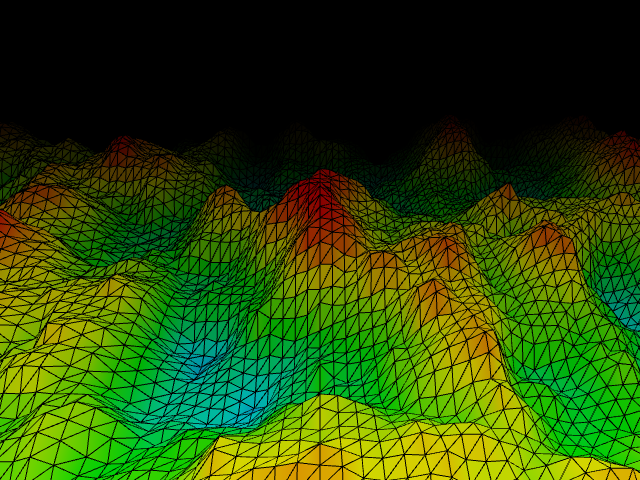

# Processing 3D Terrain

Inspired by [this video](https://www.youtube.com/watch?v=IKB1hWWedMk)
I created my own version of 3D terrain in Processing. In this version
the terrain is colored depending on the height: red means high and
blue means low. It's also interactive, as you can use these keys:

- Up/down/left/right: move the camera
- w/s speed up or slow down the flying speed
- spacebar: pause the flying

See [this video](https://youtu.be/2N-t3u2dtXs) for the demo. Below is
a screenshow of a frame:

